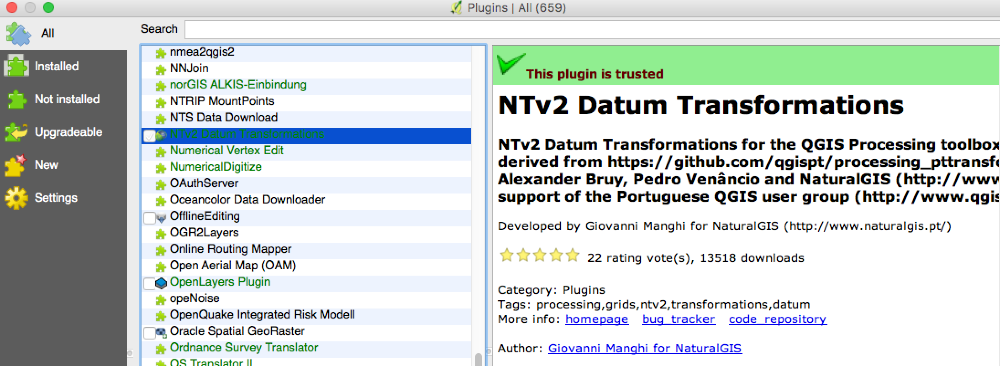
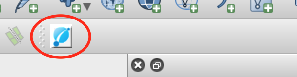

# ICSM NTv2 Transformer Plugin for QGIS

## Introduction

The ICSM NTv2 Transformer plugin for QGIS was commission by [ICSM](http://www.icsm.gov.au/) to enable the easy conversion of spatial data between Australian datums. It is envisioned that the plugin will be phased out after precise transformations are enabled in the core libraries used by open source software.

This document will cover how to install the plugin, and how to use it to carry out transformations of vector or raster data.

## Installing the plugin

QGIS has complete documentation on installing plugins, so have a look at [their documentation](http://docs.qgis.org/2.0/en/docs/training_manual/qgis_plugins/fetching_plugins.html). This plugin is titled "ICSM NTv2 Transformer". 

To install the plugin, do the following:
 * Go to the 'Plugins' menu and click 'Manage and Install Plugins' (this will update the list of available plugins as it opens)
 * Next ensure you're on the 'All' tab and search for 'icsm' (this should narrow the list of plugins down)
 * Check the box next to the plugin, and click the 'Install plugin' button.
 * Ensure that the plugin is enabled after installing it.

When the plugin is installed, you should see an icon on your QGIS toolbar that looks like the image below. If you don't, you may need to enable the plugin toolbar.

## Running a vector or raster transformation

In order to run a vector or raster transformation, choose a supported spatial file as an 'in file'. Most common formats will work. The chosen file will be analysed, in order to determine if it is supported, and it must be in a known coordinate reference system (CRS).

To run a transformation, do the following:
 * Select an 'in file', which is the dataset to be transformed
 * (Optionally) select an 'out file', which will be overwritten with the transformed file
 * Choose an 'out coordinate system', which will determine the transformation to use
 * You can check the option 'Open output after running' to load the resulting dataset into your workspace
 * Press 'OK' to run the transformation.

*Note: there is information about the transform that will be undertaken that is shown in the dialog under the plugin fields. This gives you an opportunity to understand what transformation grids will be used.*

### Further information about the plugin
Some important notes to keep in mind about the operation of this plugin:
 * If your spatial file does not have a valid CRS, QGIS should prompt you to select one.
 * If you don't select an 'out file' then the output will default to a file with '<oldfilename>_transformed'.
 * Any vector file will be saved out as a Shapefile, and any raster as a GeoTiff.

Supported coordinate reference systems include:
 * AGD66 AMG Zones 29-57 (EPSG:202xx)
 * AGD84 AMG Zones 29-57 (EPSG:203xx)
 * GDA94 MGA Zones 29-57 (EPSG:293xx)
 * GDA2020 MGA (EPSG:78xx)
 * AGD66 LonLat (EPSG:4202)
 * AGD84 LonLat (EPSG:4203)
 * GDA94 LonLat (EPSG:4283)
 * GDA2020 LonLat (EPSG:7844)

## Extras

### Support

If you're having trouble with this plugin, you can find support through the community at [GIS StackExchange](http://gis.stackexchange.com).

If there are bugs or problems with the plugin, you can raise an issue against the [project on GitHub](https://github.com/icsm-au/icsm_qgis_transformer/issues).
